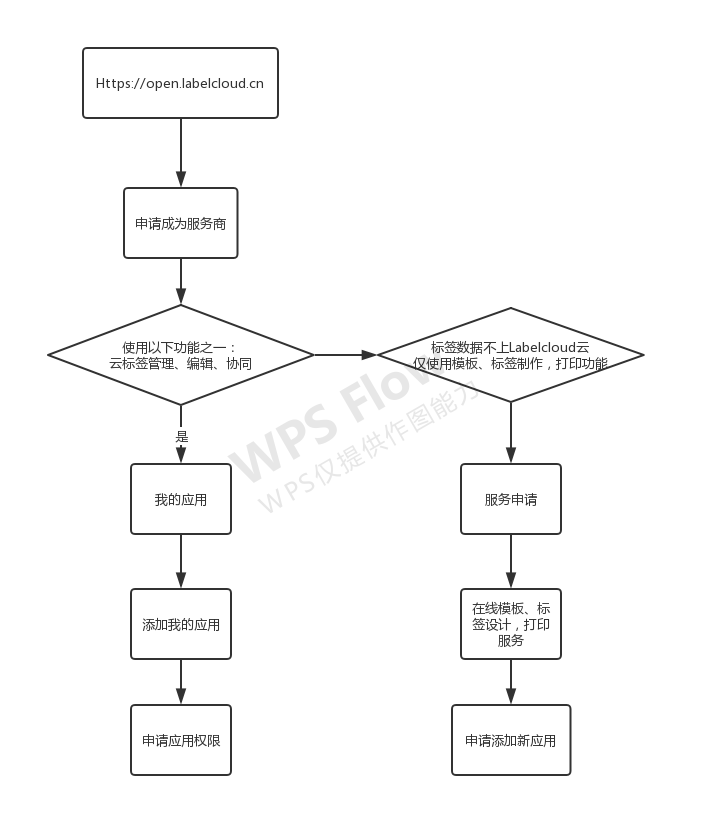

# 平台概述

### 概述
Labelcloud 开放平台是为广大第三方服务商提供标签服务核心功能的平台。
入驻Labelcloud开放平台，不仅优先获得Labelcloud持续性开放的各项最新功能，也通过Labelcloud应用中心连接全平台海量优质的企业用户资源，为企业提供供应链解决方案。
提供开发文档和技术支持，助力开发者打造优质应用，优质服务商更将获得优先展示推荐。

### 开发者接入流程
